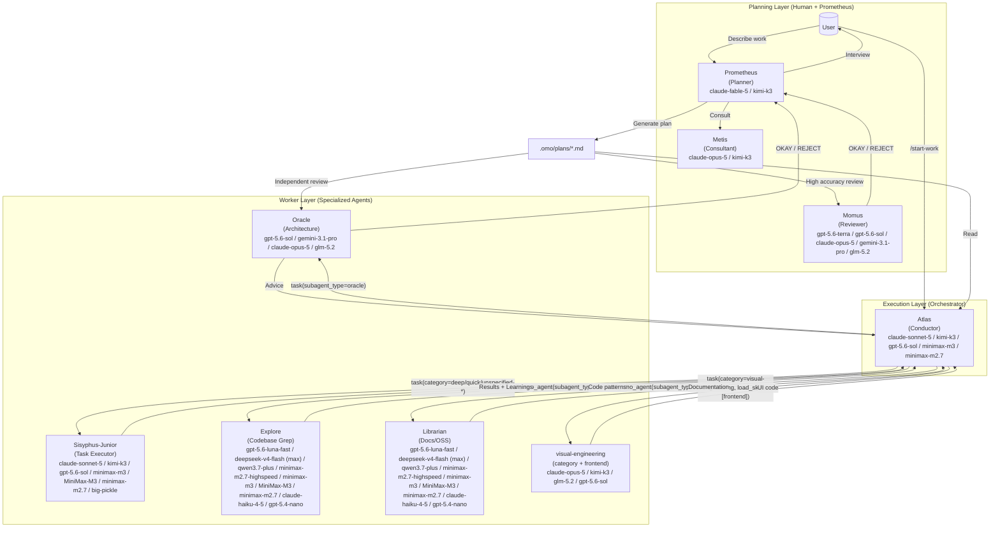
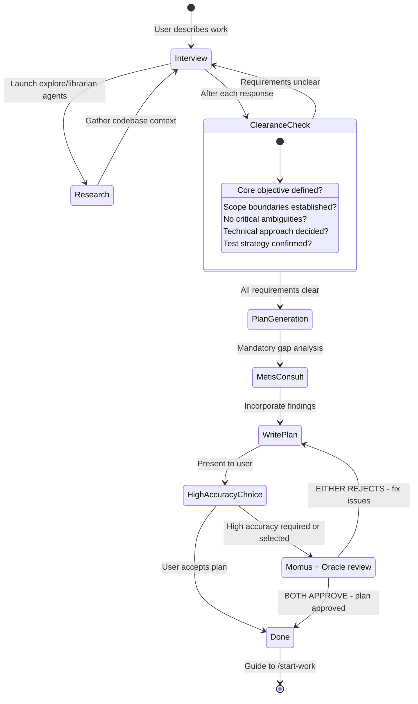
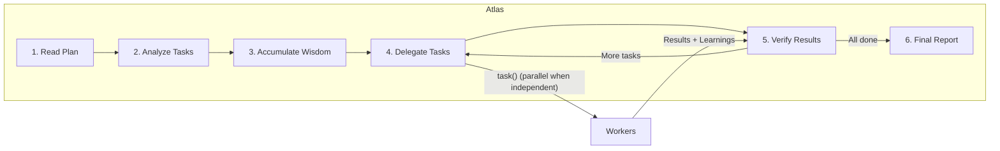

# Orchestration System Guide

Oh My OpenAgent's orchestration system transforms a simple AI agent into a coordinated development team through **separation of planning and execution**.

---

## TL;DR - When to Use What

| Complexity            | Approach                  | When to Use                                                                              |
| --------------------- | ------------------------- | ---------------------------------------------------------------------------------------- |
| **Simple**            | Just prompt               | Simple tasks, quick fixes, single-file changes                                           |
| **Complex + Lazy**    | Type `ulw` or `ultrawork` | Complex tasks where explaining context is tedious. Agent figures it out.                 |
| **Complex + Precise** | Prometheus → `/start-work` | Precise, multi-step work requiring true orchestration. Switch to Prometheus (agent selector) to plan; Atlas executes. |

**Decision Flow:**

```

Is it a quick fix or simple task?
  └─ YES → Just prompt normally
  └─ NO  → Is explaining the full context tedious?
              └─ YES → Type "ulw" and let the agent figure it out
              └─ NO  → Do you need precise, verifiable execution?
                         └─ YES → Switch to Prometheus (agent selector) for planning, then /start-work
                         └─ NO  → Just use "ulw"
```

---

## The Architecture

The orchestration system uses a three-layer architecture that solves context overload, cognitive drift, and verification gaps through specialization and delegation.



Model labels above show the current fallback stacks from `packages/omo-opencode/src/shared/model-requirements.ts`, not marketing names.

### Agent Inventory and Modes (Current)

The system has **11 built-in agents**:

- Primary: `sisyphus`, `hephaestus`, `prometheus`, `atlas`
- Subagent: `oracle`, `librarian`, `explore`, `multimodal-looker`, `metis`, `momus`, `sisyphus-junior`

Canonical assembly order for primary agents is:

`Sisyphus → Hephaestus → Prometheus → Atlas`

Mode distinction:

- `mode: "primary"`: top-level session agents selected directly in UI/CLI
- `mode: "subagent"`: worker/consultant agents invoked via `task(..., subagent_type="...")` or `call_omo_agent(...)`

### Display Names vs Providers

`Sisyphus - ultraworker` is the display name for the primary Sisyphus agent. It is not a separate provider, proxy, or replacement for your original model account.

Three names can appear together in logs or the TUI:

- **Agent display name**: `Sisyphus - ultraworker`, `Atlas - Plan Executor`, `Hephaestus - Deep Agent`
- **Provider namespace**: `anthropic`, `openai`, `github-copilot`, `opencode`, `opencode-go`, `vercel`
- **Model id**: `claude-opus-5`, `kimi-k3`, `gpt-5.6-sol`, `glm-5.2`

The agent decides the prompt and behavior. The provider namespace decides which connected account or gateway serves the request. The model id decides the model family. If you see Sisyphus running through `opencode-go/kimi-k3`, that means the Sisyphus prompt is using Kimi through the OpenCode Go provider path; it does not mean OMO replaced your provider silently.

When `ulw` or `ultrawork` is present, Sisyphus receives the ultrawork instruction set for a harder autonomous task. By default it keeps the agent's configured model or fallback chain. An explicit `agents.sisyphus.ultrawork.model` or `variant` setting can override that routing for ultrawork prompts.

### Delegation Semantics (Important)

- `task(category="...")` routes to **Sisyphus-Junior** with category-optimized model routing
- `task(subagent_type="...")` invokes that specific agent directly (for example `oracle`, `explore`, `librarian`)
- Category and `subagent_type` are mutually exclusive inputs in one call

---

## Planning: Prometheus + Metis + Momus + Oracle

### Prometheus: Your Strategic Consultant

Prometheus is not just a planner, it's an intelligent interviewer that helps you think through what you actually need. The `prometheus-md-only` hook restricts its Write/Edit to `.omo/*.md`; Bash and read/search tools remain allowed, and it must not implement, including via subagents.

**The Interview Process (via `ulw-plan`):** Prometheus explores first. On CLEAR intent it interviews only the surviving owner-decisions; on UNCLEAR intent it adopts defaults. It waits for your explicit approval before writing the plan.



**Intent-Specific Strategies:**

Prometheus adapts its interview style based on what you're doing:

| Intent                 | Prometheus Focus               | Example Questions                                          |
| ---------------------- | ------------------------------ | ---------------------------------------------------------- |
| **Refactoring**        | Safety - behavior preservation | "What tests verify current behavior?" "Rollback strategy?" |
| **Build from Scratch** | Discovery - patterns first     | "Found pattern X in codebase. Follow it or deviate?"       |
| **Mid-sized Task**     | Guardrails - exact boundaries  | "What must NOT be included? Hard constraints?"             |
| **Architecture**       | Strategic - long-term impact   | "Expected lifespan? Scale requirements?"                   |

### Metis: The Gap Analyzer

Before Prometheus writes the plan, Metis catches what Prometheus missed:

- Hidden intentions in user's request
- Ambiguities that could derail implementation
- AI-slop patterns (over-engineering, scope creep)
- Missing acceptance criteria
- Edge cases not addressed

**Why Metis Exists:**

The plan author (Prometheus) has "ADHD working memory" - it makes connections that never make it onto the page. Metis forces externalization of implicit knowledge.

### High-Accuracy Review: Momus + Oracle

High-accuracy mode runs two independent reviews in parallel: Momus checks plan quality and Oracle checks the plan on the strongest available reasoning model. Both must approve before handoff.

**The Dual-Review Loop:**

Momus is approval-biased and rejects only verified blockers. It checks that:

- Referenced files exist and support the plan's claims
- Every task gives a developer a usable starting point
- Tasks do not contradict each other
- QA scenarios name the tool, steps, and expected result
- No missing information would completely stop execution

Minor gaps and details that a developer can resolve during implementation do not block approval; a plan that is roughly 80% clear is considered executable.

If either reviewer rejects the plan, Prometheus fixes every cited issue and resubmits to both reviewers. Review rounds are capped at 5 unless you explicitly ask to continue.

### Where to Spend a Scarce Premium Model

Choose a compatible role before optimizing for invocation frequency. For example, a scarce Claude-family model such as Fable 5 fits Metis better than GPT-oriented Oracle or Momus. High-accuracy planning also runs Oracle and Momus together on every review round, so neither is purely an on-demand slot in that workflow.

See [Agent-Model Matching: Where to Spend One Scarce Premium Model](./agent-model-matching.md#where-to-spend-one-scarce-premium-model) for the family-aware heuristic and a concrete configuration.

---

## Execution: Atlas

### The Conductor Mindset

Atlas is like an orchestra conductor: it doesn't play instruments, it ensures perfect harmony.



**What Atlas CAN do:**

- Read files to understand context
- Run commands to verify results
- Use lsp_diagnostics to check for errors
- Search patterns with grep/glob/ast-grep

**What Atlas is prompted to always delegate (warn-only enforcement):**

- Writing or editing code files
- Fixing bugs
- Creating tests

Direct Write/Edit of non-`.omo` files by Atlas gets a warning, not a hard block, and git commits are not tool-gated — the discipline lives in the prompt, not the harness.

### Wisdom Accumulation

The power of orchestration is cumulative learning. After each task:

1. Extract learnings from subagent's response
2. Categorize into: Conventions, Successes, Failures, Gotchas, Commands
3. Pass forward to ALL subsequent subagents

This prevents repeating mistakes and ensures consistent patterns.

**Notepad System:**

```
.omo/notepads/{plan-name}/
├── learnings.md      # Patterns, conventions, successful approaches
├── decisions.md      # Architectural choices and rationales
├── issues.md         # Problems, blockers, gotchas encountered
└── problems.md       # Unresolved issues, technical debt
```

---

## Workers: Sisyphus-Junior and Specialists

### Sisyphus-Junior: The Task Executor

Junior is the workhorse that actually writes code. Key characteristics:

- **Focused**: Cannot delegate (blocked from task tool)
- **Disciplined**: Obsessive todo tracking
- **Verified**: Must pass lsp_diagnostics before completion
- **Constrained**: Cannot delegate via `task()` (blocked); `call_omo_agent` stays available for explore/librarian. Plan-file writes are not tool-blocked.

**Why the fallback chain is sufficient:**

Junior doesn't need to be the smartest - it needs to be reliable. With:

1. Detailed prompts from Atlas (50-200 lines)
2. Accumulated wisdom passed forward
3. Clear MUST DO / MUST NOT DO constraints
4. Verification requirements

Even a mid-tier execution model works when the harness is strict. The current fallback order is `claude-sonnet-5` → `kimi-k3` → `gpt-5.6-sol` → `minimax-m3` → `minimax-m2.7` → `big-pickle`. The intelligence is in the **system**, not a single worker model.

### System Reminder Mechanism

The hook system ensures Junior never stops halfway:

```
[SYSTEM REMINDER - TODO CONTINUATION]

Incomplete tasks remain in your todo list. Continue working on the next pending task — without asking, and re-examining any false completion claims.
```

This "boulder pushing" mechanism is why the system is named after Sisyphus.

---

## Category + Skill System

### Why Categories are Revolutionary

**The Problem with Model Names:**

```typescript
// OLD: Model name creates distributional bias
task({ agent: "gpt-5.6-sol", prompt: "..." }); // Model knows its limitations
task({ agent: "claude-opus-5", prompt: "..." }); // Different self-perception
```

**The Solution: Semantic Categories:**

```typescript
// NEW: Category describes INTENT, not implementation
task({ category: "ultrabrain", prompt: "..." }); // "Think strategically"
task({ category: "visual-engineering", prompt: "..." }); // "Design beautifully"
task({ category: "quick", prompt: "..." }); // "Just get it done fast"
```

### Delegate-Task Categories

`task(category="...")` supports these category names in user-facing orchestration:

`visual-engineering`, `artistry`, `ultrabrain`, `deep`, `quick`, `unspecified-low`, `unspecified-high`, `writing`

Notes:

- Authoritative built-in fallback chains are defined in `packages/model-core/src/category-model-requirements.ts`; `packages/omo-opencode/src/shared/model-requirements.ts` is only a re-export shim
- Projects/users can define additional categories via config; names such as `quick-rust`, `quick-zig`, or `git` are user-defined rather than built in
- Regardless of category name, category dispatch goes through Sisyphus-Junior

### Skills: Domain-Specific Instructions

Skills prepend specialized instructions to subagent prompts:

```typescript
// Category + Skill combination
task(
  (category = "visual-engineering"),
  (load_skills = ["frontend"]), // Adds UI/UX expertise
  (prompt = "..."),
);

task(
  (category = "deep"),
  (load_skills = ["playwright"]), // Adds browser automation expertise
  (prompt = "..."),
);
```

Skill loading priority is:

`project > opencode > user > builtin`

### Skill MCP (Tier 3)

Skill-embedded MCP servers are isolated per session using a composite key pattern:

`${sessionID}:${skillName}:${serverName}`

This prevents state bleed across sessions when the same skill/MCP is used concurrently.

### Background Task Concurrency

Background task concurrency defaults to **5** when no overrides are configured.

- Keyed by model/provider routing key
- Configurable via `background_task.defaultConcurrency`, `background_task.providerConcurrency`, and `background_task.modelConcurrency`

### Team Mode

Team mode is parallel multi-agent orchestration and is **OFF by default**.

For `subagent_type` team members, current eligibility is:

- Eligible: `sisyphus`, `atlas`, `sisyphus-junior`
- Conditional: `hephaestus` (requires teammate permission enablement)
- Hard-reject: `oracle`, `librarian`, `explore`, `multimodal-looker`, `metis`, `momus`, `prometheus`

Why `oracle`/`prometheus` are rejected in team members:

- Oracle is read-only (cannot write/edit/patch/delegate)
- Prometheus is constrained to `.omo/*.md` writes by the `prometheus-md-only` hook

---

## Usage Patterns

### How to Invoke Prometheus

**Method 1: Switch to Prometheus Agent (Tab → Select Prometheus)**

```
1. Press Tab at the prompt
2. Select "Prometheus" from the agent list
3. Describe your work: "I want to refactor the auth system"
4. Answer interview questions
5. Prometheus creates plan in .omo/plans/{name}.md
```

**Alternative: `/hyperplan`**

When you want adversarial multi-agent planning instead of a single planner, run `/hyperplan` from Sisyphus — it cross-critiques the plan before it is handed to `/start-work`.

**Which Should You Use?**

| Scenario                          | Recommended Method         | Why                                                  |
| --------------------------------- | -------------------------- | ---------------------------------------------------- |
| **New session, starting fresh**   | Switch to Prometheus agent | Clean mental model - you're entering "planning mode" |
| **Want explicit control**         | Switch to Prometheus agent | Clear separation of planning vs execution contexts   |
| **Adversarial, high-rigor plan**  | `/hyperplan`               | Cross-critique debate before the plan is written     |

### /start-work Behavior and Session Continuity

**What Happens When You Run /start-work:**

```
User: /start-work
    ↓
[start-work hook activates]
    ↓
Parse: /start-work [plan-name] [--worktree <path>] [--make-pr] [--ship]
    ↓
Check: active/paused works in .omo/boulder.json?
    ↓
    ├─ SEVERAL → ask which work to resume
    ├─ EXACTLY ONE → RESUME MODE
    │   - Read the existing boulder state
    │   - Calculate progress (checked vs unchecked boxes)
    │   - Inject continuation prompt with remaining tasks
    │   - Atlas continues where you left off
    │
    └─ NONE (fresh start) → INIT MODE
        - Discover incomplete plans: the plan most recently referenced
          in this session wins; one incomplete plan auto-selects;
          several incomplete plans ask you to pick
        - Create new boulder.json tracking this plan
        - Switch session agent to Atlas
        - Begin execution from task 1
```

**Session Continuity Explained:**

The `boulder.json` file is a multi-work registry (`works` + `active_work_id`). Each tracked work records:

- **active_plan**: Path to the current plan file
- **session_ids**: All sessions that have worked on this plan
- **started_at**: When work began
- **plan_name**: Human-readable plan identifier
- **worktree_path** (optional): The task-owned worktree for the work

**Example Timeline:**

```
Monday 9:00 AM
  └─ Switch to Prometheus: "Build user authentication"
  └─ Prometheus interviews and creates plan
  └─ User: /start-work
  └─ Atlas begins execution, creates boulder.json
  └─ Task 1 complete, Task 2 in progress...
  └─ [Session ends - computer crash, user logout, etc.]

Monday 2:00 PM (NEW SESSION)
  └─ User opens new session (agent = Sisyphus by default)
  └─ User: /start-work
  └─ [start-work hook reads boulder.json]
  └─ "Resuming 'Build user authentication' - 3 of 8 tasks complete"
  └─ Atlas continues from Task 3 (no context lost)
```

Atlas is automatically activated when you run `/start-work`. You don't need to manually switch to Atlas.

### Hephaestus vs Sisyphus + ultrawork

**Quick Comparison:**

| Aspect          | Hephaestus                                 | Sisyphus + `ulw` / `ultrawork`                       |
| --------------- | ------------------------------------------ | ---------------------------------------------------- |
| **Model**       | `gpt-5.6-sol` (`medium`) when available, with `gpt-5.6-sol` (`medium`) only | `claude-opus-5` / `kimi-k3` / `gpt-5.6-sol` / `glm-5.2` depending on setup |
| **Approach**    | Autonomous deep worker                     | Keyword-activated ultrawork mode                     |
| **Best For**    | Complex architectural work, deep reasoning | General complex tasks, "just do it" scenarios        |
| **Planning**    | Self-plans during execution                | Executes Prometheus plans via `/start-work` (Atlas), not by typing `ulw` |
| **Delegation**  | Heavy use of explore/librarian agents      | Uses category-based delegation                       |

**When to Use Hephaestus:**

Switch to Hephaestus (Tab → Select Hephaestus) when:

1. **Deep architectural reasoning needed**
   - "Design a new plugin system"
   - "Refactor this monolith into microservices"

2. **Complex debugging requiring inference chains**
   - "Why does this race condition only happen on Tuesdays?"
   - "Trace this memory leak through 15 files"

3. **Cross-domain knowledge synthesis**
   - "Integrate our Rust core with the TypeScript frontend"
   - "Migrate from MongoDB to PostgreSQL with zero downtime"

4. **You specifically want GPT-native autonomous reasoning**
   - Hephaestus prefers GPT-5.6 Sol when OpenAI or Vercel exposes it and retains GPT-5.6 Sol as the broad fallback

**When to Use Sisyphus + `ulw`:**

Use the `ulw` keyword in Sisyphus when:

1. **You want the agent to figure it out**
   - "ulw fix the failing tests"
   - "ulw add input validation to the API"

2. **Complex but well-scoped tasks**
   - "ulw implement JWT authentication following our patterns"
   - "ulw create a new CLI command for deployments"

3. **You're feeling lazy** (officially supported use case)
   - Don't want to write detailed requirements
   - Trust the agent to explore and decide

4. **You want plan-driven execution**
   - Run `/start-work` instead: it hands an existing Prometheus plan to Atlas
   - `ulw` explores autonomously and does not resume plans

**Recommendation:**

- **For most users**: Use `ulw` keyword in Sisyphus. It's the default path and works excellently for 90% of complex tasks.
- **For power users**: Switch to Hephaestus when you want GPT-native reasoning or the "AmpCode deep mode" experience of fully autonomous exploration and execution.

### Brownfield / KISS Mode

For mature projects, the safest default is not "make the best architecture." It is "make the smallest correct change that fits the architecture already here."

Use Prometheus first when a brownfield task could invite broad cleanup, rewrites, or speculative abstractions. Select Prometheus with the agent selector or `/agent`, then ask it to produce a constrained plan with explicit boundaries:

```text
Fix <problem> in this existing codebase.
Preserve the current architecture and public behavior.
Use the smallest viable change.
Follow local patterns in <files or areas>.
Do not refactor, rename, reorganize, or clean up unrelated code.
List exact files in scope and exact verification commands.
```

Then run `/start-work` from that plan. Atlas will execute against the written scope instead of treating the task as an open-ended modernization pass.

Use `ulw` directly only when the target is already narrow:

```text
ulw fix the null handling in packages/foo/src/bar.ts using the existing helper style. No unrelated cleanup.
```

Use Hephaestus when you deliberately want autonomous deep implementation or architectural exploration. If the job is "touch the old system without disturbing it," an explicit Prometheus plan provides written scope boundaries before Atlas starts execution.

---

## Configuration

The `sisyphus_agent` object of `~/.omo/omo.jsonc` exposes optional legacy Sisyphus/planner compatibility toggles: `disabled`, `default_builder_enabled`, `planner_enabled`, `replace_plan`, and `tdd`. These fields do not enable Atlas orchestration; omit them unless you need the legacy behavior they control.

```jsonc
{
  "sisyphus_agent": {
    "planner_enabled": true,
    "replace_plan": true,
    "tdd": true,
  },

  // Hook settings (add to disable)
  "disabled_hooks": [
    // "start-work",             // Disable execution trigger
    // "prometheus-md-only"      // Remove Prometheus write restrictions (not recommended)
  ],
}
```

---

## Troubleshooting

### "I switched to Prometheus but nothing happened"

Prometheus explores first. On CLEAR intent it asks only the remaining owner-decisions; on UNCLEAR intent it adopts defaults. Approve the brief to have the plan written to `.omo/plans/`. There is no "make it a plan" trigger.

### "/start-work says 'no active plan found'"

- If you see **No Plans Found**, no plans exist in `.omo/plans/` → Create one with Prometheus first
- If several active works exist, pick one explicitly with `/start-work {plan-name}`
- Deleting `.omo/boulder.json` is not the first fix — unrelated boulder state is ignored when it does not match

### "I'm in Atlas but I want to switch back to normal mode"

Start a new session, or use the agent selector to switch back to Sisyphus. There is no OMO `exit` command. Atlas is primarily entered via `/start-work` - you don't typically "switch to Atlas" manually.

### "Should I use Hephaestus or type ulw?"

**For most tasks**: Type `ulw` in Sisyphus.

**Use Hephaestus when**: You need GPT-native reasoning for deep architectural work or complex debugging.

---

## Further Reading

- [Overview](./overview.md)
- [Features Reference](../reference/features.md)
- [Configuration Reference](../reference/configuration.md)
- [Manifesto](../manifesto.md)
